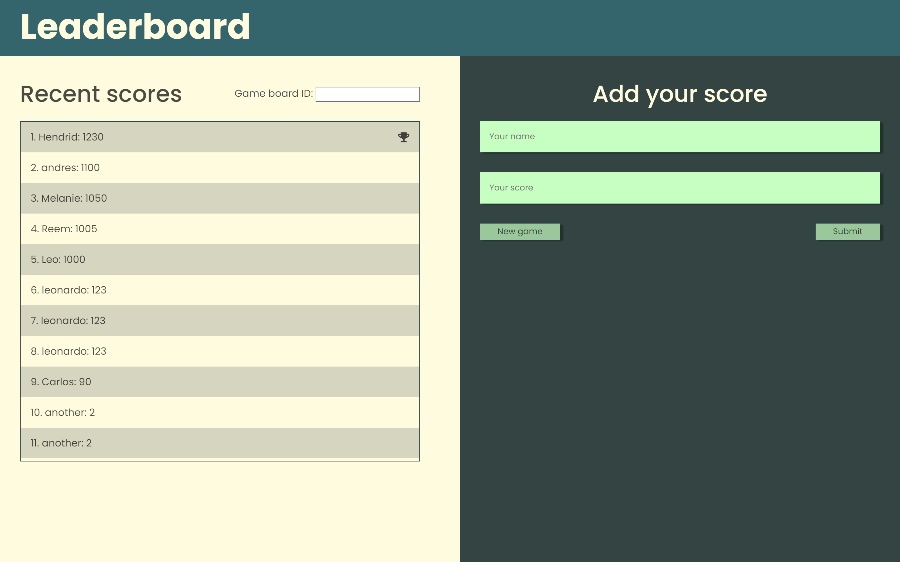

# Leaderboard

> This is a leaderboard that allows the user to created boards and input scores to them usin Rest API. Also, it saves new boards into local storage.

## Built With

- Major languages
  - HTML
  - Javascript
  - SASS
- Technologies used
  - npm
  - webpack

## Live Demo (if available)

[Live Demo Link](https://leboroz.github.io/leaderboard/)

## Getting Started

To get a local copy up and running follow these simple example steps.

### Prerequisites

- npm
- git

### Setup

- open terminal or bash
- run
  - `git clone https://github.com/Leboroz/leaderboard.git`

### Install

- run
  - `cd leaderboard`
  - `npm install`
  - `npm start` to run the server

### Usage

_The board displays scores from the main id which is hardcoded. To create a new board press the new game button. You can input names as strings and scores as strings_

### Deployment

- run
  - `npm run build`

👤 **Leonardo Albornoz**

- GitHub: [@Leboroz](https://github.com/leboroz)
- Twitter: [@Leboroz](https://twitter.com/leboroz)
- LinkedIn: [LinkedIn](https://www.linkedin.com/in/leonardo-albornoz-216784198/)

## 🤝 Contributing

Contributions, issues, and feature requests are welcome!

Feel free to check the [issues page](https://github.com/leboroz/leaderboard/issues).

## Show your support

Give a ⭐️ if you like this project!s

## 📝 License

This project is [MIT](./MIT.md) licensed.
